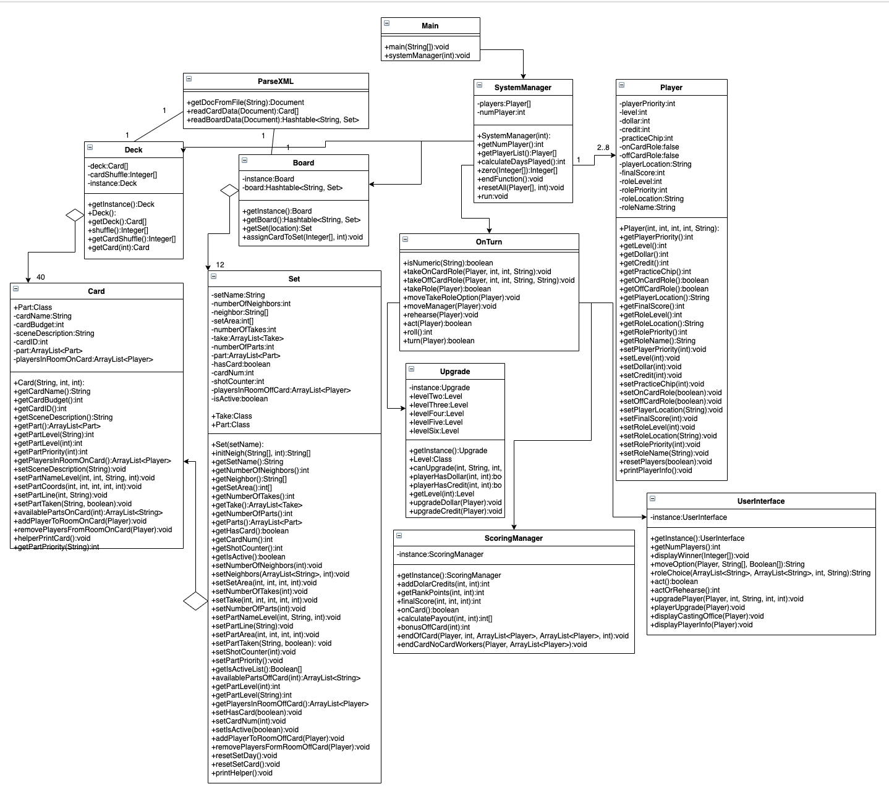

# Deadwood Game

## Overview

Board game made in the Java language.

## Implementors

Daria Miller

Taichen Rose

## Installation

### If using Github
1. Clone this repository
2. If you use Unix terminal, you can type ```make``` to compile all files or ```make clean``` to delete all compiled classes.
3. run ```java Deadwood n``` to start the program, where n is a number between 2 - 8 [This will error if you do not enter anything as n.]

### If have zipped file
1. Unzip file
2. In the home directory, type ```make``` to comiple all files or ```make clean``` to delete all compiled classes.
3. run ```java Deadwood n``` to start the program, where n is a number between 2 - 8 [This will error if you do not enter anything as n.]

## Things We Would Have Changed

1. Some of our printing is being done in OnTurn or even SystemManager class. We should have done a better job at putting that information in the UserInterface class if we had more time. Same with UserInterface, there are some calculations that are being done there, and those calculations should already have been done before it gets to that level.

2. Create more variable objects. If you look at OnTurn, there is a lot of ```Deck.getInstance.getSet().``` and more. If we stored the set and card in a variable, we could reference that object over so it would make the code easier to read.

3. We should make functions in Set.java and Card.java that will update when a player takes a role. We do this in a function in onTurn and have a lot of ```player.setRole()``` or ```player.setThis()``` when we could call a function from player that does all this information with given parameters.

4. Organize our file structure. Create src file, create static files such as our XML. For the final submission, our file structure will be more organized.

5. The printing while the player is moving in the text based version is not the best. We could have made this a little better. More intuitive, when payouts are being calculated some players are printed twice, they have the same info, but this just isn't necessary.

## Classes

Below in this section gives a list of our classes in a small detailed form. Essentially, we tried to keep all data in their own classes. For example, information that was pulled from parser regarding Board would be stored in the individidual Sets (Set class) and all sets would be combined into Board through a HashTable so look up times would be fast and easy.

For Cards the rationale regarding the Set to Board is the same for Card to Deck. We pulled information from the parser and added to each Card object, and Deck would hold the array of Cards objects. The way we would randomize the cards at each start game is we had an Integer array of 1 through 40. We shuffled that array, and stored it in a variable. Whenvever we needed to set the card to a set, we would call that array, with the parameter of day so we would know on the first day, set the first 10 card numbers to the first ten sets. Second day, take the second ten numbers in the array and apply, etc.

### Deadwood

Main class is the class that will be run initially and calls system manager to start the game. This class prompts how many players will be playing.

### SystemManager 

This class is the power of this game. It will create the player objects, manage how many days will be played, and will trigger the onTurn functions for each player when it's their turn. Will also calculate end of game metrics by calling ScoringManager and will reset each day by calling helper functions.

### OnTurn

This class has everything to do with player choices in game. Whether they decide to upgrade (which will call upgrade class), Act, Rehearse, Move, or take a role. All these interactions and calculations will be done in this class

### ScoringManager

This class will do anything scoring related. It will calculate the score payouts at the end of the card. Also will calculate the final scores at the end of the game. Will also distribute those payout to players

### Upgrade

Deals with all upgrading in game. Will check if user has enough to upgrade Will call from UserInterface to help display and get user input on upgrade

### UserInterface

Display user prompts and get user input throughout the game

### Set

Will hold all data from board.xml. Will use the getters/setters to grab and give the information. Will keep a list of players on the offCard roles, and has functions to reset all the variables if it's the next day

### Player

Store all player information, also has function that will reset player variables at the end of card or end of day

### ParseXML

Used this file to parse from XML files to populate card data and set/board data.

### Deck

Creates a Deck of Card objects (40). Will create an int array of card order for the game

### Card

This class is populated by cards.xml using the parser. Will store what players have taken a role on the card. 

### Board

This class will hold all sets in a hashtable. Decided to use this data structure to increase look up times by names of sets. Has a function to assign card to each set at start of day

## UML Diagram



